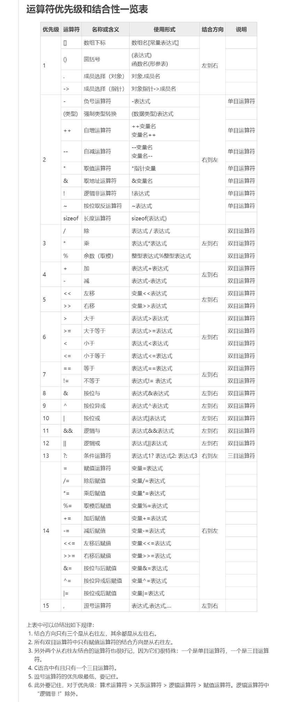
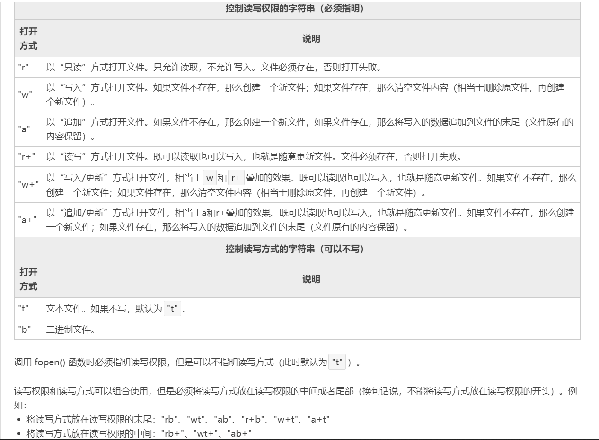

[TOC]

# 数据类型与运算符

## 基本数据类型

### 整型

+ 短整型
  + 声明：`[unsigned] short/int var`
  + 长度：2B(16b)，$ -2^{15}～2^{15}或0～~2^{16}-1$
  + 输出格式控制符：%hd，%d，%u，%o，%x，%X，%p(指针)

+ 长整型
  + 声明：`[unsigned] long [long] var`
  + 长度：4B(32b)，$ -2^{31}～2^{31}或0～2^{32}-1$
  + 输出格式控制符：%ld，%lu，%llu

### 字符型

- 声明：`[unsigned] char var`

- 长度：1B(8b)

- 输出格式控制符：%c，%u，%s(char\*)

- 转义字符：

  | 转义字符 | 含义                      | 转义字符 | 含义                    |
  | -------- | ------------------------- | -------- | ----------------------- |
  | `\n`     | 回车换行符                | `\r`     | 回车符                  |
  | `\t`     | 制表符                    | `\b`     | 退格                    |
  | `\v`     | 竖向跳格                  | `\a`     | 鸣铃                    |
  | `\\`     | 反斜杠符                  | `\%`     | 百分号符                |
  | `\'`     | 单引号符                  | `\"`     | 双引号符                |
  | `\ddd`   | 1~3位八进制数字代表的字符 | `xhh`    | 1~2位十六进制代表的字符 |

### 实型

- 声明：`float/double var`
- 长度：4B/8B(32b/64b)
- 输出格式控制符：%f，%lf，%e，%E，%g，%G

## 构造数据类型

### 数组类型

+ 声明：`type [*...*]var[]...[][[NUM]][ = {values}];`
+ 引用：`var[i]`，`*(var+i)`，`var[i][j]`...
+ 其他：`char var[NUM]`不能在定义以后才赋`string`，数组名是指针常量，不能被改变

### 结构体类型

+ 声明：`struct [name] {type property;...} [var,*ptr...];`
+ 引用：`var.property`，`*(ptr).property`，`ptr->property`
+ 其他：结构体允许嵌套，允许结构体之间直接赋值，但不允许通过`var = {value,...}`整体赋值

### 联合体类型（共用体类型）

+ 声明：`union [name] {type property;...} [var,*ptr...];`
+ 引用：`var.property`，`*(ptr).property`，`ptr->property`
+ 其他：联合体允许嵌套，变量间共用存储空间，允许联合体之间直接赋值，也允许通过`var = {value}`赋值

### 位域

- 声明：`struct [name] {type [property] : size;...} [var,*ptr...];`
- 引用：`var.property`，`*(ptr).property`，`ptr->property`
- 其他：结构体允许嵌套，允许结构体之间直接赋值，但不允许通过`var = {value,...}`整体赋值

### 枚举类型

- 声明：`enum name {element[ = value],...} [var,*ptr...];`
- 使用：`var = element; `
- 其他：`{element,...}`存在默认值`{0, 1, 2, ...}`，允许在初始化时赋值，此后`element`为常量不能再次赋值

## 指针类型

### 指针类别

+ 一级指针
  + 声明：`type *p[ = &var|ptr];`
  + 值引用：`*(p+i)`，`p[i]`

+ 数组指针（行指针）
  + 声明：`type (*p)[NUM];[ = arr]`
  + 值引用：`*(p+i)`，`p[i]`，`p[i][j]`，`*(p+i*n+j)`，`*(*(p+i)+j)`
  + 其他：不可与指针数组`type *p[NUM]`弄混，此处`p`是数组名不是指针变量，不可赋值

+ 函数指针
  + 声明：`type (*p)(types)`
  + 使用：`p = func;`

+ 零指针（空指针）：`NULL`或`0`，系统保证该单元不作它用
+ 空类型指针：`void *p;`，使用时需要强制类型转换，如`type *var = (type*)p;`

### 指针分配与释放

+ 分配：`void *malloc(unsigned int size);`
+ 分配并置零：`void *calloc(unsigned int num, unsigned int size);`
+ 重新分配不覆盖：`void *realloc(void *ptr, unsigned int size);`
+ 释放：`void free(void *ptr);`
+ 其他：以上函数都包含在`<stdlib.h>`，所有分配过内存的指针`p`都要`free(p)`

## 运算符



# 输入输出

## 控制台输入输出

+ `int printf(const char *format,...);`
  + 格式控制字符串：`%[-][+][#][0][width][.precision]Type`
  + 所属头文件：`<stdio.h>`
  + 返回值：被打印的字符数
+ `int scanf(const char *format,...);`
  + 格式控制字符串：`%[*][width]Type`
  + 所属头文件：`<stdio.h>`
  + 返回值：成功读入的数据项数
+ `int fflush(FILE *stream);`
  + 功能：清空`stream`
  + 返回值：非负数

## 字符(串)输入输出

+ `int getchar(void);`
  + 功能：当`\n`存在于`stdin`时从中读入第一个字符
  + 所属头文件：`<stdio.h>`
  + 返回值：接收到字符的ASCII码
+ `int putchar(int c);`
  - 功能：输出`c`到`stdout`
  - 所属头文件：`<stdio.h>`
  - 返回值：输出字符的ASCII码
+ `int getc(FILE *stream);`
  + 功能：从`stream`中读入一个字符
  + 所属头文件：`<stdio.h>`
  + 返回值：接收到字符的ASCII码
+ `int putc(int c, FILE *stream);`
  - 功能：输出`c`到`stream`
  - 所属头文件：`<stdio.h>`
  - 返回值：输出字符的ASCII码
+ `int getche(void);`
  + 功能：从键盘直接读入一个字符，回显
  + 所属头文件：`<conio.h>`
  + 返回值：接收到字符的ASCII码
+ `int getch(void);`
  - 功能：从键盘直接读入一个字符，不回显
  - 所属头文件：`<conio.h>`
  - 返回值：接收到字符的ASCII码
+ `char *gets(char *buffer);`
  + 功能：从`stdin`读入字符串，包含空格
  + 所属头文件：`<stdio.h>`
  + 返回值：返回与参数`buffer`相同的指针
+ `int puts(const char *string);`
  - 功能：输出`string`至`stdout`
  - 所属头文件：`<stdio.h>`
  - 返回值：非负数

## 文件输入输出

+ 文件打开
  + 声明：`FILE *fopen(char *filename, char *mode);`
  + 说明：
  + 返回值：文件指针
+ 文件关闭
  + 声明：`int *fclose(FILE *filepointer);`
  + 返回值：`0`
+ 读字符
  + 声明：`int fgetc(FILE *filepointer);`
  + 返回值：读出字符的ASCII码
+ 写字符
  - 声明：`int fputc(int c, FILE *filepointer);`
  - 返回值：写入字符的ASCII码
+ 读字符串
  - 声明：`char *fgets(char *s, int n, FILE *filepointer);`
  - 返回值：读取的字符串的指针
+ 写字符串
  - 声明：`int fputs(char *s, FILE *filepointer);`
  - 返回值：最后写入字符的ASCII码
+ 读数据块
  + 声明：`unsigned fread(void *ptr, unsigned size, unsigned n, FILE *filepointer);`
  + 返回值：读取的数据项个数
+ 写数据块
  - 声明：`unsigned fwrite(void *ptr, unsigned size, unsigned n, FILE *filepointer);`
  - 返回值：读取的数据项个数
+ 格式化读
  + 声明：`int fscanf(FILE *filepointer, const char *format[, address,...]);`
  + 返回值：读取的数据项个数
+ 格式化写
  - 声明：`int fprintf(FILE *filepointer, const char *format[, address,...]);`
  - 返回值：写入的数据的字节个数
+ 文件指针置零
  + 声明：`void rewind(FILE *filepointer);`
+ 文件指针定位
  + 声明：`int fseek(FILE *filepointer, long offset, int whence);`
  + 返回值：`0`
  + 其他：`whence`的常量值有`SEEK_SET|0`，`SEEK_CUR|1`，`SEEK_END|2`
+ 获取文件指针位置
  + 声明：`long ftell(FILE *filepointer);`
  + 返回值：当前读写位置指针的值（用相对文件开头的偏移量表示）
+ 读文件结束
  + 声明：`int feof(FILE *filepointer);`
  + 返回值：逻辑真`(1)`
+ 文件重命名
  + 声明：`int rename(const char *oldname, const char *newname);`
  + 返回值：`0`
+ 其他
  + 文件打开可能会失败，需要检验；打开后记得关闭文件
  + `fprintf()`总是以字符串形式将数据存放至文件
  + `fgetc()`和`fputc()`常用来读写单个字符
  + `fgets()`和`fputs()`常用来读写字符串
  + `fread()`和`fwrite()`常用来读写二进制文件及不含格式的文件
  + `fscanf()`和`fprintf()`常用来读写文本文件及含有格式的文件

# 程序结构

## 顺序结构

+ 略

## 选择结构

+ `if`结构：`if (situation) {statements}`
+ `if-else`结构：`if (situation) {statements} else {statemens}`
+ `if-else if-...-else`结构：`if (situation) {statements} else if (situation) {statements} else{statements}`
+ `switch-case`结构：`switch(situation){case int_item:statements break;...[default: statements break;]}`
+ `goto-label`结构：`label:{statements}...goto label;`
+ `break`语句：跳出循环
+ `continue`语句：直接进入下一次循环

## 循环结构

+ `for`结构：`for (initial; situation; statements) {statements}`
+ `while`结构：`while(statements) {statements}`
+ `do-while`结构：`do {statements} while(statements);`

# 函数

## 类型

+ 按返回值
  + 无返回值：`void func([args]);`
  + 有返回值：`type [*]func([args])`;

+ 按参数
  + 无参数：`type [*]func();`
  + 有参数（基本类型(指针)）：`type [*]func(type [*]var, ...);`
  + 有参数（构造类型(指针)）：`type [*]func(struct name [*]var, union name [*]var, enum name [*]var)`

## 变量的存储类型

+ 自动变量（auto变量）
  + 声明：`[auto] type var[ = value];`
  + 内容：局部变量，动态存储变量，默认类型为auto，只能在函数或复合语句中定义
+ 外部变量（extern变量）
  + 声明：`extern type var[ = value];`
  + 内容：全局变量，静态存储变量，允许被另一源程序引用
+ 静态变量（static变量）
  + 声明：`static type var[ = value];`
  + 内容：静态存储变量，静态局部变量在函数或复合语句执行退出后保持其值，生存期为整个源程序，作用域为函数或复合语句，全局变量允许被另一源程序引用，而静态全局变量只在本源程序有效
+ 寄存器变量（register变量）
  + 声明：`register type var[ = value];`
  + 内容：对于频繁读写的变量，将访问内存储器变为访问寄存器，提高效率

# 其他

## 关键字

| 关键字     | 说明                                               |
| ---------- | -------------------------------------------------- |
| `char`     | 声明字符型变量或函数                               |
| `double`   | 声明双精度变量或函数                               |
| `enum`     | 声明枚举类型                                       |
| `float`    | 声明浮点型变量或函数                               |
| `int`      | 声明整型变量或函数                                 |
| `long`     | 声明长整型变量或函数                               |
| `short`    | 声明短整型变量或函数                               |
| `signed`   | 声明有符号类型变量或函数                           |
| `struct`   | 声明结构体变量或函数                               |
| `union`    | 声明共用体（联合）数据类型                         |
| `unsigned` | 声明无符号类型变量或函数                           |
| `void`     | 声明函数无返回值或无参数，声明无类型指针           |
| `for`      | 一种循环语句                                       |
| `do`       | 循环语句的循环体                                   |
| `while`    | 循环语句的循环条件                                 |
| `break`    | 跳出当前循环                                       |
| `continue` | 结束当前循环，开始下一轮循环                       |
| `if`       | 条件语句                                           |
| `else`     | 条件语句否定分支（与`if`连用）                     |
| `goto`     | 无条件跳转语句                                     |
| `switch`   | 用于开关语句                                       |
| `case`     | 开关语句分支                                       |
| `default`  | 开关语句中的“其他”分支                             |
| `return`   | 子程序返回语句（可以带参数，也看不带参数）         |
| `auto`     | 声明自动变量 一般不使用                            |
| `extern`   | 声明变量是在其他文件正声明（也可以看做是引用变量） |
| `register` | 声明寄存器变量                                     |
| `static`   | 声明静态变量                                       |
| `const`    | 声明只读变量                                       |
| `sizeof`   | 计算数据类型长度                                   |
| `typedef`  | 用以给数据类型取别名                               |
| `volatile` | 说明变量在程序执行中可被隐含地改变                 |

## 预处理命令

### 宏定义

+ 类型
  + 不带参数：`#define VAR value`
  + 带参数：`define VAR(args) expression`

+ 其他
  + 撤消定义：`#undef VAR`
  + 细节：允许重复定义；带参数宏定义的表达式最好加括号

### 文件包含

+ 类型：`#include<head_file.h>`，`#include"head_file.h"`

### 条件编译

+ 类型
  + `#if-#elif-...-#else-#endif`结构：`#if situation statements #elif situation statements...#else statements #endif `
  + `#ifdef-#else-#endif`结构：`#ifdef VAR statements #else statements #endif`
  + `#ifndef-#else-#endif`结构：`#ifndef VAR statements #else statements #endif`

# 常用库函数

## `<stdio.h>`

+ `int printf(const char *format, args, ...);`
+ `int scanf(const char *format, args, ...);`
+ `int getc(FILE *filepointer);`
+ `int putc(int ch, FILE *filepointer);`
+ `int getchar(void);`
+ `int putchar(char ch);`
+ `char *gets(char *str);`
+ `int puts(const char *str);`
+ `int sprintf(char *str, const char *format, args, ...);`
+ `int sscanf(char *str, const char *format, args, ...);`
+ `FILE *fopen(const char *filepointer, const char *mode);`
+ `int fclose(FILE *filepointer);`
+ `int feof(FILE *filepointer);`
+ `int ferror(FILE *filepointer);`
+ `int fseek(FILE *filepointer, long offset, int whence);`
+ `int ftell(FILE *filepointer);`
+ `void rewind(FILE *filepointer);`
+ `int fflush(FILE *filepointer);`
+ `int fseek(FILE *filepointer, long int offset, int base);`
+ `int fgetc(FILE *filepointer);`
+ `int fputc(int ch, FILE *filepointer);`
+ `int fgetchar(void);`
+ `int fputchar(int ch);`
+ `char *fgets(char *buf, int n, FILE *filepointer);`
+ `int fputs(const char *str, FILE *filepointer);`
+ `unsigned fread(void *ptr, unsigned size, unsigned n, FILE *filepointer);`
+ `unsigned fwrite(void *ptr, unsigned size, unsigned n, FILE *filepointer);`
+ `int fscanf(FILE *filepointer, const char *format[, address,...]);`
+ `int fprintf(FILE *filepointer, const char *format[, address,...]);`

## `<stdlib.h>`

+ `void exit(int code);`
+ `int rand(void);`
+ `int srand(unsigned int seed);`
+ `void *malloc(unsigned size);`
+ `void *realloc(void *p, unsigned size);`
+ `void *calloc(unsigned n, unsigned size);`
+ `void free(void *p);`
+ `double atof(const char *str);`
+ `int atoi(const char *str);`
+ `int atol(const char *str);`
+ `char *itoa(int value, char *str, int radix);`
+ `char *ltoa(long value, char *str, int radix);`
+ `char *ultoa(unsigned long value, char *str, int radix);`

## `<math.h>`

+ `int abs(int x);`
+ `long labs(long x);`
+ `double fabs(double x);`
+ `double ceil(double x);`
+ `double floor(double x);`
+ `double sqrt(double x);` 
+ `double sin(double x);`
+ `double cos(double x);`
+ `double tan(double x);`
+ `double asin(double x);`
+ `double acos(double x);`
+ `double atan(double x);`
+ `double log(double x);`
+ `double log10(double x);`
+ `double exp(double x);`
+ `double pow(double x, double y);`
+ `double fmod(double x, double y);`

## `<string.h>`

+ `unsigned int strlen(const char *str);`
+ `char *strcpy(char *str1, const char *str2);`
+ `char *strncpy(char *str1, const char *str2, unsigned int count);`
+ `char *strcat(char *str1, const char *str2);`
+ `char *strncat(char *str1, const char *str2, unsigned int count);`
+ `int strcmp(char *str1, const char *str2);`
+ `int strncmp(char *str1, const char *str2, unsigned int count);`
+ `int stricmp(char *str1, const char *str2);`
+ `int strnicmp(char *str1, const char *str2, unsigned int count);`
+ `char *strset(char *str, int c);`
+ `char *strnset(char *str, int c, unsigned int count);`
+ `char *strchr(const char *str, int c);`
+ `char *strrchr(const char *str, int c);`
+ `int strstr(const char *str1, const char *str2);`
+ `char *strupr(char *str);`
+ `char *strlwr(char *str);`
+ `void *memcpy(void *to, const void *from, unsigned int count);`
+ `void *memset(void *buf, int ch, unsigned int count);`
+ `void *memmove(void *tp, const void *from, unsigned int count);`
+ `int memcmp(const void *buf1, const void *buf2, unsigned int count);`

## `<ctype.h>`

+ `int isalnum(int ch);`
+ `int isalpha(int ch);`
+ `int isdigit(int ch);`
+ `int isxdigit(int ch);`
+ `int isascii(int ch);`
+ `int isprint(int ch);`
+ `int isspace(int ch);`
+ `int ispunct(int ch);`
+ `int isgraph(int ch);`
+ `int isupper(int ch);`
+ `int islower(int ch);`
+ `int toupper(int ch);`
+ `int tolower(int ch);`

## `<conio.h>`

+ `int getch(void);`
+ `int getche(void);`

## `<time.h>`

+ ```c
  #define CLOCK_PER_SEC	//	这个宏表示每秒的处理器时钟个数。用于将clock()函数的结果转化为以秒为单位								的量，这个量的具体值是与操作系统相关的，通常为1000。
  #define size_t			//是无符号整数类型，它是 sizeof 关键字的结果。
  #define clock_t			//这是一个适合存储处理器时间的类型，类型为unsigned long
  #define time_t			//这是一个适合存储日历时间类型。
  struct tm 
  {
     	int tm_sec;         /* 秒，范围从 0 到 59      */
     	int tm_min;         /* 分，范围从 0 到 59      */
     	int tm_hour;        /* 小时，范围从 0 到 23     */
     	int tm_mday;        /* 一月中的第几天，范围从 1 到 31    */
     	int tm_mon;         /* 月，范围从 0 到 11(注意)  */
     	int tm_year;        /* 自 1900 年起的年数      */
     	int tm_wday;        /* 一周中的第几天，范围从 0 到 6 */
    	int tm_yday;        /* 一年中的第几天，范围从 0 到 365   */
    	int tm_isdst;       /* 夏令时               */
     /*	
     	size_t		是无符号整数类型，它是 sizeof 关键字的结果。
  	clock_t		这是一个适合存储处理器时间的类型，类型为unsigned long
  	time_t		这是一个适合存储日历时间类型。
  	struct tm	这是一个用来保存时间和日期的结构。
  	*/
  };
  /*format如下：它们是区分大小写的。 
      %a 星期几的简写 
      %A 星期几的全称 
      %b 月分的简写 
      %B 月份的全称 
      %c 标准的日期的时间串 
      %C 年份的后两位数字 
      %d 十进制表示的每月的第几天 
      %D 月/天/年 
      %e 在两字符域中，十进制表示的每月的第几天 
      %F 年-月-日 
      %g 年份的后两位数字，使用基于周的年 
      %G 年分，使用基于周的年 
      %h 简写的月份名 
      %H 24小时制的小时 
      %I 12小时制的小时 
      %j 十进制表示的每年的第几天 
      %m 十进制表示的月份 
      %M 十时制表示的分钟数 
      %n 新行符 
      %p 本地的AM或PM的等价显示 
      %r 12小时的时间 
      %R 显示小时和分钟：hh:mm 
      %S 十进制的秒数 
      %t 水平制表符 
      %T 显示时分秒：hh:mm:ss 
      %u 每周的第几天，星期一为第一天 （值从0到6，星期一为0） 
      %U 第年的第几周，把星期日做为第一天（值从0到53） 
      %V 每年的第几周，使用基于周的年 
      %w 十进制表示的星期几（值从0到6，星期天为0） 
      %W 每年的第几周，把星期一做为第一天（值从0到53） 
      %x 标准的日期串 
      %X 标准的时间串 
      %y 不带世纪的十进制年份（值从0到99） 
      %Y 带世纪部分的十进制年份 
      %z，%Z 时区名称，如果不能得到时区名称则返回空字符。 
      %% 百分号 
  */
  ```

  + `pass`

+ `clock_t clock(void);`

+ `time_t time(time_t *timer);`

+ `struct tm *localtime(const time_t *timer);`

+ `struct tm *gmtime(time_t *timer);`

+ `char *asctime(struct tm *ptr);`

+ `char *ctime(const time_t *timer);`

+ `double difftime(time_t time2, time_t time1);`

+ `time_t mktime(struct tm *timeptr)`

+ `size_t strftime(char *strDest, size_t maxsize, const char *format, const struct tm *timeptr);`


